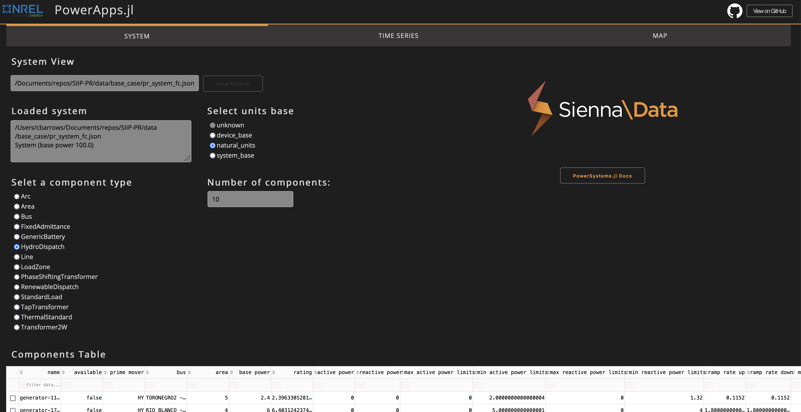
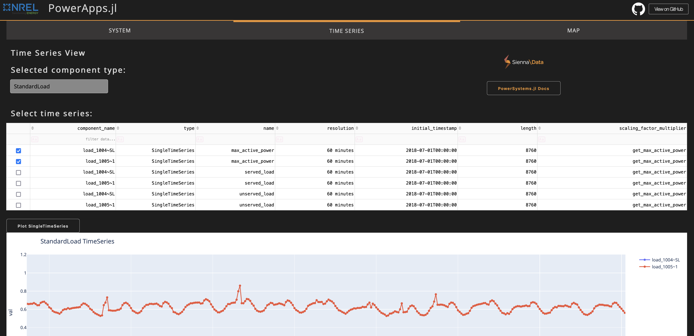
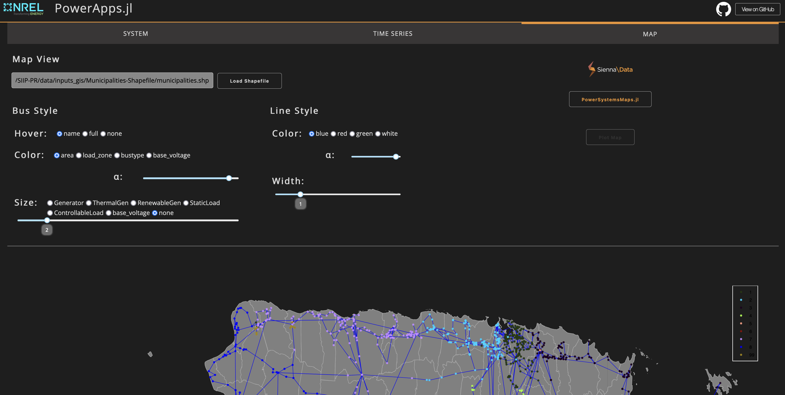

# PowerApps.jl

The `PowerApps.jl` package provides tools to view and manage systems created with
[PowerSystems.jl](https://github.com/NREL-Sienna/PowerSystems.jl) in a web app interface like the one shown here:





## Usage

```julia
julia> ]add PowerApps
```

### PowerSystems Explorer

This application allows users to browse PowerSystems components and time series data in a web UI
via Plotly Dash. Here's how to start it:

```julia
julia> using PowerApps
julia> run_system_explorer()
[ Info: Navigate browser to: http://0.0.0.0:8050
[ Info: Listening on: 0.0.0.0:8050
```

Open your browser to the IP address and port listed. In this case: `http://0.0.0.0:8050`.
The System Explorer app will appear with three tabs:

- System: enter a path to a raw data file or serialized JSON and load the system.
Component data can be explored by type, and can be sorted and filtered.
- Time Series: time series data for components selected on the "System" tab can be viewed
and visualized
- Maps: a shapefile can be loaded (optional), and nodes (`Bus`) and `Branch`s can be plotted.
Several configuration options provide opportunities to visualize the geo-spatial data.
*note: geospatial layouts are significantly more useful when "latitude" and "longitude" is defined
in the `Bus.ext` fields. Without bus coordinates, an automatic layout will be applied*

## Developers

Consult https://dash.plotly.com/julia for help extending the UI.

Set the environment variable `SIENNA_DEBUG` to enable hot-reloading of the UI.

Mac or Linux
```
$ export SIENNA_DEBUG=1
# or
$ SIENNA_DEBUG=1 julia --project src/system_explorer_app.jl
```

Windows PowerShell
```
$Env:SIENNA_DEBUG = "1"
```

## License

PowerApps.jl is released under a BSD [license](https://github.com/NREL/PowerApps.jl/blob/master/LICENSE).
PowerApps.jl has been developed as part of the Sienna
ecosystem at the U.S. Department of Energy's National Renewable Energy Laboratory ([NREL](https://www.nrel.gov/)).
